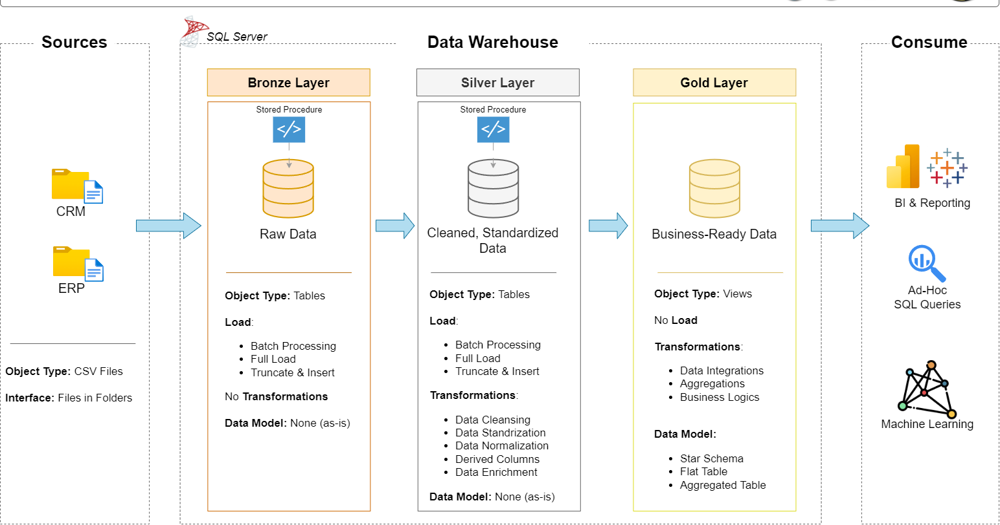
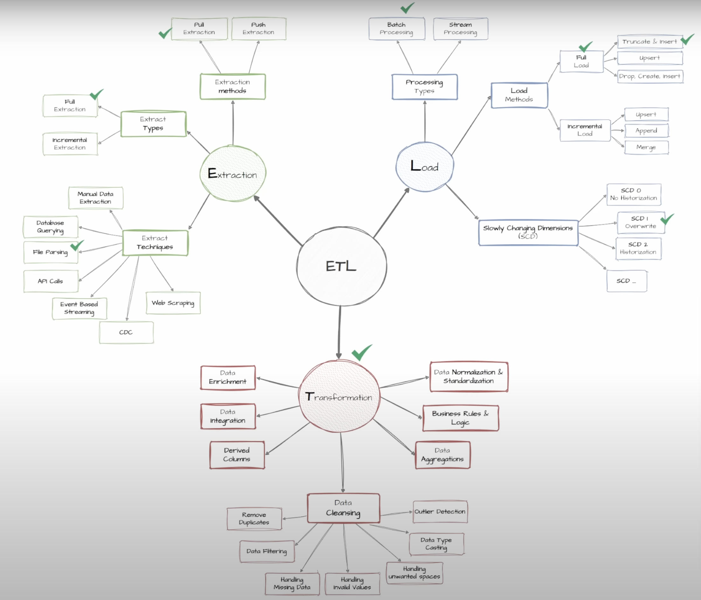

# 🏗️ SQL Data Warehouse Project

A complete end-to-end data warehousing solution simulating real-world CRM and ERP data integration. This project demonstrates how raw data can be transformed into meaningful business insights through a multi-layered architecture. Built entirely in SQL, it highlights essential ETL concepts, data modeling, and quality validation.

---

## 📊 Project Objective

To build a modular, well-structured data warehouse that:
- Ingests raw data from CRM and ERP systems
- Cleans and transforms data into structured formats
- Organizes it using a Star Schema for easy reporting and business intelligence

---

## 🏢 Medallion Architecture (Bronze → Silver → Gold)

This project follows the **Medallion Architecture**, organizing data into three structured layers:

- **Bronze Layer**: Raw ingested data (as-is from CRM/ERP)
- **Silver Layer**: Cleaned, standardized, and enriched datasets
- **Gold Layer**: Business-ready fact and dimension views for analytics, reporting, and ML

### 📈 Medallion Architecture Flow

---

## ⚙️ ETL Methods Used in This Project

From the wide range of ETL strategies available, this project adopts the most effective industry-standard methods for real-world use cases.

✅ Implemented methods include:
- **Pull Extraction**
- **File Parsing**
- **Batch Processing**
- **Full Load (Truncate & Insert)**
- **SCD Type 1 (Overwrite)**
- **Data Cleansing, Enrichment, Normalization**
- **Data Aggregation and Business Logic**

### 📌 ETL Coverage Visualization

> ✔️ Green checkmarks in the diagram indicate the exact methods applied during pipeline development.

---

## 🚀 Project Architecture

The project follows a **three-layer architecture**:

### 1. 🟫 Bronze Layer – Raw Data Ingestion
- **Data Source**: Flat files from CRM (`cust_info.csv`, `prd_info.csv`, `sales_details.csv`) and ERP systems (`LOC_A101.csv`, `PX_CAT_G1V2.csv`)
- **SQL Used**: `init_database.sql`, `ddl_bronze.sql`, `proc_load_bronze.sql`
- **Purpose**: Load raw data as-is without modifications for traceability

### 2. 🪙 Silver Layer – Data Cleansing and Structuring
- **SQL Used**: `ddl_silver.sql`, `proc_load_silver.sql`, `quality_checks_silver.sql`
- **Purpose**:
  - Clean and standardize formats
  - Remove nulls or duplicate data
  - Enrich with business logic (e.g., calculated columns)

### 3. 🥇 Gold Layer – Analytics-Ready
- **SQL Used**: `ddl_gold.sql`, `quality_checks_gold.sql`
- **Fact Table**: `fact_sales`
- **Dimension Tables**: `dim_customers`, `dim_products`
- **Purpose**:
  - Reshape into star schema
  - Enable efficient querying and reporting for stakeholders

---

## 💡 Key Features

- ✅ **Structured ETL pipeline** using modular SQL scripts
- ⚖️ **Quality checks** at Silver and Gold layers
- 📈 **Business-aligned modeling** with facts and dimensions
- 📚 **Documented architecture**, naming standards, and data dictionary

---

## 📃 Supporting Assets

- **Data Architecture**: `Data_flow.png`, `Data_Integration.png`, `Data_Model.png`
- **ETL Diagrams**: `ETL methods.png`, `ETL_methods_used_in_the_project.png`
- **Docs**:
  - `data_catalog.md` – Data dictionary for gold layer
  - `data_layers.pdf` – Explanation of bronze/silver/gold layers
  - `naming_conventions.md` – Object naming rules

---

## 🎓 Skills Demonstrated

- SQL joins (inner, left), subqueries, CTEs
- Data modeling using Star Schema
- Surrogate keys, technical metadata columns
- Stored Procedures for ETL automation
- Data quality auditing and validation

---

## ✅ How to Use

1. Run `init_database.sql` to set up the environment  
2. Load Bronze layer using `proc_load_bronze.sql`  
3. Clean data into Silver layer using `proc_load_silver.sql`  
4. Create Gold layer with `ddl_gold.sql`  
5. Run quality checks from `quality_checks_silver.sql` and `quality_checks_gold.sql`  

---

## 🌟 Outcome

This project simulates a real-world data warehousing process and equips professionals with hands-on experience in:
- Handling messy enterprise data
- Structuring data pipelines
- Preparing data for analytics and BI

Ideal for roles in **Data Engineering**, **Business Intelligence**, and **Data Analytics**.

